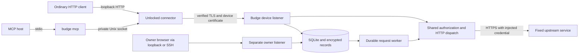

# Architecture and boundaries

The product contract is BUILD_HANDOFF.md. One Go binary provides the server, enrollment, connector, and MCP stdio adapter. One server owns one SQLite database. There is no imported old implementation, external executor, policy framework, OAuth broker, or provider-specific request transformation.

## Authority

An invitation transfers an HTTPS origin, public trust root, and one-use five-minute secret. Its secret is stored only as a hash. The client makes its own P-256 key and CSR; the server assigns identity and certificate usage. All requests recheck certificate time and device revocation, even on existing connections. Certificates last 30 days and renew in their final seven days. Possession of key material identifies a caller; it does not establish hardware integrity or process identity.

Only password-authenticated owner sessions create services/permissions or decide requests. Password hashing and unlock derivation use Argon2id (64 MiB, three iterations, two lanes, 32-byte output). AES-GCM binds ciphertext to purpose/record identity with fresh cryptographic nonces. The unlock secret is supplied interactively or by a dedicated input descriptor and is never persisted. Credentials are write only through owner controls. Losing unlock authority loses the encrypted material.

## Authorization and execution

Exact/segment-subtree scopes bind device, service revision, explicit method list, mode, owner and optional expiry. Overlapping active rules are rejected in the write transaction. Security-relevant service replacement invalidates old permissions and cancels undispatched requests. Query and body contents are outside permission matching; Budge does not enforce spending, recipient or model semantics.

HTTP and MCP share path validation, service lookup, authorization and credential/header/destination dispatch. MCP adds an immutable encrypted snapshot, a versioned SHA-256 digest, owner review, and durable claim/result handling. The approval digest is checked both at decision time and dispatch claim. A transaction records `dispatching` before transmission; revocation blocks subsequent claims but cannot retract claimed/running work.

Every outbound dispatch uses a fresh HTTP/1 transport with no pool reuse, redirects, environment proxies, decompression, explicit retries, or GetBody replay function. This deliberately pays a new upstream TLS handshake cost to avoid transport-level replay, including for idempotent-looking methods and provider idempotency headers. It is one automatic dispatch attempt per durable request, not exactly-once execution. Incomplete/lost responses and interrupted dispatches are uncertain and never automatically retried.

## Confinement and data

HTTPS destinations are fixed per service. DNS is resolved at connection time; all answers must pass address checks, then the dialer connects to a validated address while standard TLS validates the configured hostname. Private destinations need an explicit per-service CIDR. Loopback/link-local/metadata addresses remain blocked, including shared IPv4 address space and IPv4 translation prefixes. Tests inject a TLS mock transport in `_test.go` files; the packaged binary has no loopback-upstream exception.

Only allowed application headers cross upstream boundaries. Client authentication, cookies, identity/forwarding controls, method overrides, hop-by-hop headers and Connection-nominated headers are stripped. Upstream authentication is added last. A trusted upstream can reflect its own credential; this is explicitly outside the custody guarantee.

HTTP bodies are transient. Stored MCP snapshots/results are encrypted; audit events use identifiers and outcomes instead of body/query/path content. Terminal MCP payloads are purged after 24 hours while deduplication tombstones remain. The database and its audit are trusted local state, not a tamper-proof ledger.

The server locks the database inode for its lifetime. SQLite transactions never remain open across upstream I/O. Restored backups cannot safely resume normal dispatch: `--recover-restored` invalidates device access, owner sessions, and pending/queued requests before listeners start. Missing deduplication history and provider effects require manual reconciliation.

## Deployment and verified limits

The container has a read-only root filesystem and runs as UID 65532; its named data volume is private/writable. The owner listener binds all interfaces only inside explicitly selected container mode, with an expected loopback Host. Compose publishes the owner port on host 127.0.0.1. Docker publication settings are part of the boundary, not a property the HTTP process can infer.

The connector is a device-wide capability, not per-process authentication. Its HTTP listener rejects browser-origin signals, CORS preflights and unexpected Host values. MCP's Unix socket and directory require matching user ownership and modes 0600/0700. Credentials remain in unlocked server memory; a compromised trusted server or owner browser defeats that boundary.

See docs/verification.md for observed evidence and remaining checks, and docs/measurements.md for measured costs. This deployment requires unlocking on restart; no unattended operation is claimed.
