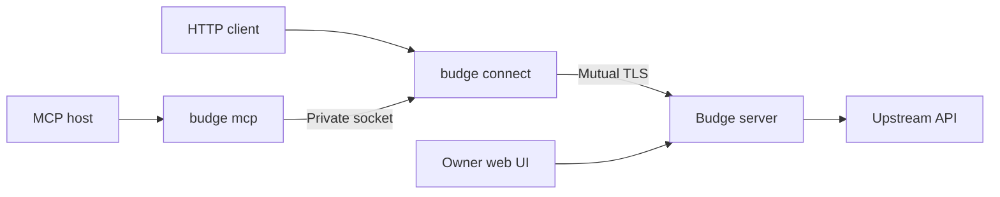

# Budge

**Give a device access to an API without giving it the API key.**

Budge is a self-hosted HTTP gateway. Your API credentials stay on a trusted machine, and you decide which services an enrolled device can use. A client points its base URL at Budge and keeps using the upstream API's usual paths and request bodies.

There are two ways to grant access:

- **Standing permission:** allow a method and path until you revoke it, with an optional expiry. Ordinary HTTP clients can use this access directly, including streaming responses.
- **Individual approval:** an agent submits a request through MCP. You review its URL, headers and body in the web UI, then approve or deny it. The agent can check back for the result.

Budge runs as one server container with SQLite, plus a small client on each device. The client and server come from the same Go binary.



**Project status:** an early version, tested against local mock services. HTTP forwarding, streaming, approvals and recovery have integration coverage. curl and OpenCode have been checked as clients; a live OpenCode/OpenRouter generation request has not been tested. Build from source for now—there is no published binary release or container image.

[Get started](#get-started) · [HTTP clients](#use-an-http-client) · [MCP](#use-an-mcp-host) · [Remote devices](#use-a-remote-device) · [Operations](#operate-and-recover) · [Limits](#limits-and-boundaries) · [Development](#development)

## Get started

This walkthrough runs the server and connector on the same Linux machine. For a device on another machine, read [remote setup](#use-a-remote-device) **before the first server start** so invitations contain the right server address.

You need **Docker with Compose** for the server and **Go 1.27.1** to build the client.

### 1. Get the code and build the client

```sh
git clone https://github.com/aubwang/budge.git
cd budge
scripts/build-linux.sh
```

This creates `bin/budge-linux-amd64` and `bin/budge-linux-arm64`. The examples below use amd64; use arm64 on an ARM machine. You can copy the matching binary to another Linux device.

### 2. Start the server

```sh
docker compose build
docker compose run --rm --service-ports budge
```

On the first start, choose two secrets, each at least 12 characters long. Typing is hidden.

| Secret | What it does | When you need it |
| --- | --- | --- |
| Server unlock secret | Unlocks encrypted credentials, keys and stored request data | Every server start |
| Owner password | Signs you into the web UI | When logging in |

Open **<http://127.0.0.1:18780>** and sign in with the owner password.

The container stays attached to your terminal. Stopping it leaves its database in the named Docker volume. Later starts ask only for the unlock secret. Keep that secret safe: losing it makes the encrypted data unrecoverable.

### 3. Add a service

In the web UI, give the service a short lowercase ID, a label you recognize, and its HTTPS base URL. The ID becomes part of the connector URL, such as `/s/reports`.

Choose how Budge should authenticate to the upstream:

| Mode | What you enter |
| --- | --- |
| `bearer` | A token for the `Authorization: Bearer …` header |
| `header` | A header name, such as `X-API-Key`, and its value |
| `basic` | A username and password as `username:password` |
| `none` | Nothing |

An OAuth access token or JWT works as a supplied bearer token. Budge does not perform OAuth login, refresh tokens, or generate/sign JWTs. Saved credentials cannot be read back through the UI.

Start with the default header lists: `Accept, Content-Type` for requests and `Content-Type, Content-Encoding, Retry-After` for responses. Add other application headers your API needs. Authentication, cookie, forwarding and connection-control headers are handled or blocked by Budge rather than passed through from the caller.

### 4. Enroll a device and grant access

Create a device invitation in the UI, then run this on the device:

```sh
./bin/budge-linux-amd64 enroll
```

Paste the invitation at the hidden prompt and choose a local identity passphrase of at least 12 characters. Invitations work once and expire after five minutes. Transfer them privately; avoid putting them in command arguments or logs.

Enrollment gives the device an identity, **not service access**. Back in the UI, grant it a service, explicit HTTP methods and an exact path or path subtree. Choose standing or approval-required access. Leave expiry blank for access that lasts until revoked.

For example, a standing permission for `POST /v1/jobs` allows that route; a subtree permission for `/v1/jobs` also covers paths such as `/v1/jobs/123`. Overlapping active permissions are rejected.

### 5. Start the connector

```sh
./bin/budge-linux-amd64 connect
```

Enter the identity passphrase and leave the connector running. Your client can now reach permitted routes at:

```text
http://127.0.0.1:18782/s/SERVICE/PATH
```

The encrypted identity is stored in `budge/device.identity` under your user's config directory, normally `~/.config` on Linux. All local processes that can reach the connector share that device's permissions.

## Use an HTTP client

Change the client's base URL to the connector's service URL. Keep using the upstream API's methods, paths, query strings and request bodies. Budge removes `/s/SERVICE` and appends the rest of the path to the configured upstream base; it does not add provider-specific paths or transform the body. Permission and header rules still apply.

For an illustrative service named `reports`:

| Setting | Value |
| --- | --- |
| Upstream base configured in Budge | `https://api.example.com/api` |
| Client base URL | `http://127.0.0.1:18782/s/reports` |
| Client requests | `/v1/jobs` |
| Upstream receives | `/api/v1/jobs` |

If your client requires an API-key field, use the nonsecret placeholder **`budge-local`**. Budge supplies the real upstream credential on the server. Clients that normally include a version prefix such as `/v1` in their base URL should include that same prefix after `/s/SERVICE`.

<details>
<summary>Example: OpenCode with an OpenRouter service</summary>

Create a service named `openrouter` with upstream base `https://openrouter.ai/api` and grant standing `POST /v1/chat/completions`. Add this fragment to your OpenCode configuration:

```json
{
  "provider": {
    "openrouter": {
      "options": {
        "baseURL": "http://127.0.0.1:18782/s/openrouter/v1",
        "apiKey": "budge-local"
      }
    }
  }
}
```

This configuration was loaded by OpenCode 1.18.20 in isolated settings. A live provider generation test remains pending. The example is ordinary client configuration; Budge has no OpenCode-specific setup command.

</details>

## Use an MCP host

Keep the connector running, and configure your MCP host to launch the binary with the `mcp` argument using **stdio**:

```sh
/absolute/path/to/budge-linux-amd64 mcp
```

The MCP process talks to the connector over a private local socket. It does not ask for passwords on its protocol stream.

<details>
<summary>Example MCP configuration for OpenCode</summary>

```json
{
  "mcp": {
    "budge": {
      "type": "local",
      "command": ["/absolute/path/to/budge-linux-amd64", "mcp"],
      "enabled": true
    }
  }
}
```

Other hosts have their own configuration format; use the same executable and argument.

</details>

Your host gets three tools:

| Tool | Purpose |
| --- | --- |
| `budge_services` | List this device's services and permission scopes |
| `budge_request` | Submit a finite HTTP request for execution or approval |
| `budge_request_status` | Check its state and retrieve its result |

A submission includes `service`, `method`, `path`, and a client-generated `idempotency_key`. It can also include a raw `query`, string-valued `headers`, and a UTF-8 `body`. Unknown arguments are rejected.

Requests with standing permission are queued immediately. Requests requiring approval appear in your inbox. Review the actual URL, headers, body, expiry and digest before approving. You cannot edit a pending request; changed content needs a new submission.

An ordinary HTTP call to an approval-required route returns `approval_required`. Use MCP to submit it for review.

Use the returned request ID to check progress. Status calls can wait up to 15 seconds using `wait_seconds`. **Do not submit a new idempotency key just because a request is pending.** The same key and request return the original record; reusing a key with different content is a conflict.

A complete upstream response, including a 4xx or 5xx, is a completed HTTP result. Two failure states need different treatment:

- `failed` with `request_not_sent`: Budge established that no HTTP request was sent, for example because DNS or TLS failed before a usable connection.
- `outcome_unknown`: the upstream may have performed the request. Check the provider before considering another submission.

Neither state triggers an automatic retry. A new key represents a new request and may cause another effect.

## Use a remote device

By default, the container publishes both server ports only on the server machine's loopback interface. Before initializing a server for remote devices:

1. Choose an HTTPS server address the device can reach, including its port, and set it with `server --url` in the container command. See the full default command in [Dockerfile](Dockerfile).
2. Change the device port mapping in [compose.yaml](compose.yaml) to bind the desired reachable host address. Keep `--device-listen 0.0.0.0:18781` inside the container.
3. Keep the **owner** mapping at `127.0.0.1:18780:18780` and `--owner-host 127.0.0.1:18780`.

The invitation carries the server's trust root and address; enrollment validates both. A VPN or firewall can restrict access further, but it does not replace enrollment.

To administer a remote server, tunnel its owner port over SSH:

```sh
ssh -N -L 18780:127.0.0.1:18780 user@your-server
```

Then open <http://127.0.0.1:18780> on your computer. Use that exact host and port: the owner UI checks Host and Origin. Device certificates do not grant owner access.

| Listener | Default port | Where it runs |
| --- | --- | --- |
| Owner web UI | 18780 | Trusted machine, loopback only |
| Device HTTPS | 18781 | Trusted machine |
| Local HTTP connector | 18782 | Enrolled device, loopback only |

Use `server --owner-listen`, `--owner-host`, `--device-listen`, `--url`, and `connect --listen` to change addresses, with matching container mappings. `--container` permits the internal owner bind on `0.0.0.0`; the host publication must still stay on loopback. An existing database retains its initialized server URL, so keep passing that URL explicitly when changing deployment defaults. Stored identities and client settings are not rewritten automatically.

## Operate and recover

**Changing access.** Revoke a device or permission, or disable a service, in the UI. This prevents new dispatches and cancels pending/queued requests. A request already claimed for execution cannot be retracted. Replacing a service's credential, destination or header policy invalidates its old permissions; review and reissue access afterward.

**Restarting.** The server needs its unlock secret after every restart, and the connector needs its identity passphrase. The current setup therefore uses foreground, interactive startup. Database encryption protects stored data; it does not protect credentials from someone controlling the running server. Encryption is currently required.

**Certificates.** Client certificates last 30 days and renew during the final seven days while the connector runs. The renewed identity file remains encrypted and is replaced atomically. An expired or revoked device needs a new invitation. Replacing the server trust root also requires re-enrollment.

**Lost passwords or state.** Losing the server unlock secret makes encrypted data unrecoverable. The owner password is separate; there is no self-service reset flow in v1. Losing the database also loses permissions, approvals and deduplication history. Keep the Docker volume; `docker compose down -v` deletes it.

**Restoring a backup.** Before accepting traffic from a restored database, start with `server --recover-restored` plus your usual server arguments. This invalidates old device access and owner sessions and cancels undispatched requests. Check provider effects, then enroll devices and reissue access. An old backup may be missing request keys; an absent record is not evidence that retrying is safe.

<details>
<summary>Custom identity paths, sockets and secret inputs</summary>

Use `--identity` with `enroll` and `connect` for a custom identity file. For a custom socket, pass `--socket /absolute/private/connect.sock` to both `connect` and `mcp`. The socket directory must be owned by your user with mode 0700; the socket uses mode 0600. If a crash leaves a stale socket, confirm no connector is running before removing it.

Secrets can come from dedicated file descriptors instead of terminal prompts:

| Command | Input flags |
| --- | --- |
| `server` | `--unlock-fd`, `--owner-password-fd` |
| `enroll` | `--invitation-fd`, `--passphrase-fd` |
| `connect` | `--passphrase-fd` |

Each descriptor supplies one line. Pass the descriptor number as the argument, not the secret. A secret manager can supply a runtime pipe; do not put secret values in command arguments, `.env` files, container environment variables, images or plaintext files beside the database. Unattended startup requires arranging that unlock input yourself.

</details>

## Limits and boundaries

Budge controls **which HTTP methods and paths a device may call**. It does not restrict query/body fields such as recipients or models, interpret request intent, or enforce spending limits. Permissions use an exact path or segment-bounded subtree. Paths must start with one slash and cannot contain percent escapes, backslashes, empty interior segments or dot segments; trailing slashes remain distinct.

Services have fixed HTTPS destinations. Redirects and environment-derived outbound proxies are disabled. DNS addresses and TLS certificates are checked when connecting. Private destinations need an explicit service-specific CIDR allowance; loopback, link-local and metadata destinations remain blocked.

| Limit | Value |
| --- | --- |
| Ordinary HTTP request body | 8 MiB; finite uploads only |
| HTTP responses | Streaming, including SSE; 5-minute upstream read-idle timeout |
| Concurrent upstream requests | 4 per device, 32 total |
| MCP request body | 64 KiB of UTF-8 text |
| Pending approvals | 20 per device |
| Approval deadline | 10 minutes, including time queued after approval |
| Standing MCP queue deadline | 1 minute |
| MCP dispatch deadline | 2 minutes |
| Stored MCP result body | First 1 MiB; larger results marked truncated |
| Upstream response headers | 32 KiB |
| Terminal MCP payload/result retention | 24 hours; metadata and deduplication records remain |

MCP results use UTF-8 or base64 for returned bytes; encoding/envelope overhead is additional to the body limit. Incomplete results are marked explicitly. Ordinary HTTP request/response bodies are not stored. Stored MCP content can be sensitive even though it is encrypted.

Budge makes at most one automatic dispatch attempt per durable request, not a promise of exactly one effect at the provider. It also cannot hide a credential that the upstream itself reflects in a response. An enrolled identity proves possession of a key, not that the device is uncompromised. WebSockets, streaming uploads, OAuth flows and multi-user administration are outside v1.

## Development

Want to try Budge without configuring a real API? With Go 1.27.1 and curl installed, run:

```sh
scripts/build-linux.sh
scripts/demo.sh
```

The mock demo exercises enrollment, HTTP forwarding, streaming, MCP approval and crash recovery using temporary state and synthetic credentials. It makes no paid provider requests. The test-only allowance for local mock upstreams is absent from the shipped binary.

With Docker and Python 3, you can also check a clean container/client setup:

```sh
docker build -t budge-fresh:local .
python3 scripts/smoke-container.py
```

That check uses the built client and a temporary container and volume, then cleans them up. It covers hidden setup inputs, owner login, enrollment, encrypted identity storage, connector access, socket permissions and loopback publication.

Run the code checks with:

```sh
go test -race ./... -timeout 120s
go vet ./...
test -z "$(gofmt -l cmd internal web)"
```

CI also builds the Linux binaries and container and runs the clean-install check. Dependencies are pinned in `go.mod` and `go.sum`; the implementation uses Go's HTTP/TLS libraries, SQLite and the official MCP Go SDK.

For a closer look:

- [Architecture and trust boundaries](DESIGN.md)
- [Verification record](docs/verification.md)
- [Local performance measurements](docs/measurements.md)
- [Original design handoff](BUILD_HANDOFF.md) and [development notes](docs/progress.md)
